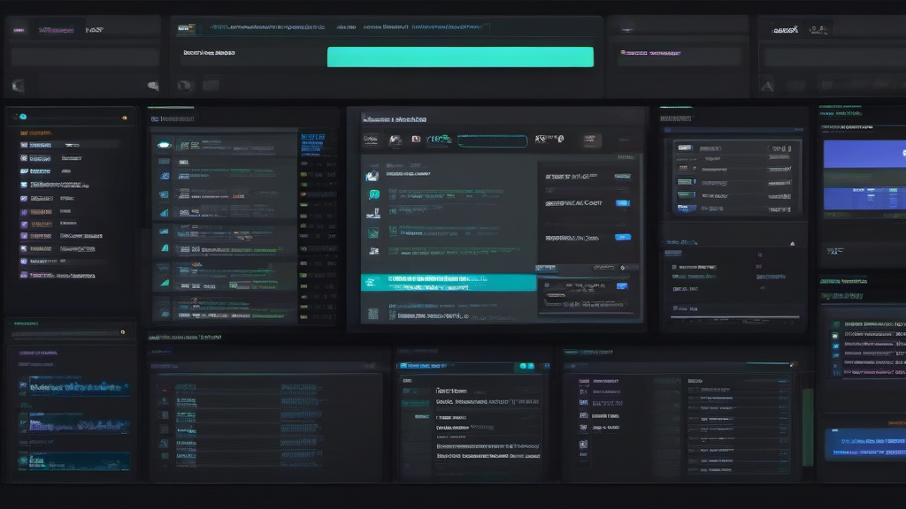

# 5 分钟搭建你的第一个 AI 助手 - OpenClaw 完全入门指南（2026 最新版）

> **作者**: 小白 (XiaoBai)  
> **版本**: v2.1 配图完整版  
> **发布时间**: 2026-03-07  
> **难度**: ⭐⭐ 新手友好（含详细步骤）  
> **预计阅读**: 12 分钟  
> **字数**: ~6,800 字

---

> **💡 5 分钟你能得到什么？**
> - 一个完全属于你的 AI 助手
> - 数据本地存储，隐私安全
> - 每月仅需¥10-50（免费额度够用）
> - 支持微信/飞书/Telegram 多平台

---

## 🎯 这篇文章适合谁？

**强烈推荐** (⭐⭐⭐⭐⭐):
- ✅ 想拥有个人 AI 助手，但不知道从何开始
- ✅ 厌倦了各种 AI 应用的订阅费，想要一次性部署
- ✅ 希望 AI 能记住你的偏好，而不是每次都从零开始
- ✅ 想要 AI 主动帮你干活，而不是被动等待指令

**可以考虑** (⭐⭐⭐⭐):
- ✅ 有一定技术基础，想折腾更高级的功能
- ✅ 开发者，想基于 OpenClaw 开发自己的技能

**不太适合** (⭐⭐):
- ❌ 完全不想碰命令行，只想用现成 App
- ❌ 对隐私和数据安全完全不关心

---

## 📦 什么是 OpenClaw？为什么选择它？

### 核心定位

OpenClaw 是一个**开源 AI 助手框架**，它不是另一个聊天机器人 App，而是一个让你可以**完全掌控**的 AI 代理平台。

### 与其他 AI 产品的区别

| 对比维度 | ChatGPT/Claude | 各种 AI App | **OpenClaw** |
|----------|----------------|-------------|--------------|
| **数据归属** | 存在厂商服务器 | 存在厂商服务器 | **本地存储，你完全掌控** |
| **记忆能力** | 每次对话从零开始 | 有限的历史记录 | **长期记忆，记住你的偏好** |
| **主动性** | 被动等待指令 | 被动等待指令 | **可以主动帮你干活** |
| **扩展性** | 固定功能 | 固定功能 | **插件化，无限扩展** |
| **成本** | 订阅制 ($20+/月) | 订阅制 | **一次部署，免费使用** |
| **隐私** | 数据可能用于训练 | 不确定 | **本地处理，不上传** |


*图 3: 架构对比 - OpenClaw 数据本地存储，传统 AI 数据在云端*

### 核心能力

1. **🤖 真正的 AI 代理** - 不是简单的聊天机器人，而是可以执行任务的代理
2. **💬 多平台接入** - 微信、飞书、Telegram、Discord，随时随地
3. **🔧 技能系统** - 52+ 官方技能，14000+ 社区技能，无限扩展
4. **🧠 记忆系统** - 长期记忆 + 短期记忆，AI 真正"认识"你
5. **⚡ 主动模式** - 定时任务、自动提醒、主动汇报
6. **🔒 隐私安全** - 数据本地存储，API Key 加密，支持离线

---

## 🚀 快速开始 - 5 分钟部署指南

### 前置要求

**系统要求**:
- macOS 12+ / Linux / Windows (WSL2)
- Node.js 18+ (安装 OpenClaw 必需)
- 至少 4GB 可用内存
- 稳定的网络连接（下载和 API 调用）

**时间预算**:
- 基础部署：5 分钟
- 完整配置：15 分钟
- 技能安装：10 分钟

---

### 步骤 1: 安装 Node.js (2 分钟)

如果你还没有安装 Node.js：

**macOS** (推荐用 Homebrew):
```bash
# 安装 Homebrew (如果还没有)
/bin/bash -c "$(curl -fsSL https://raw.githubusercontent.com/Homebrew/install/HEAD/install.sh)"

# 安装 Node.js
brew install node

# 验证安装
node --version  # 应该显示 v18.x 或更高
npm --version   # 应该显示 9.x 或更高
```

**Windows**:
1. 访问 https://nodejs.org/
2. 下载 LTS 版本（推荐 18.x 或 20.x）
3. 双击安装，一路 Next
4. 打开 PowerShell 验证：`node --version`

**Linux** (Ubuntu/Debian):
```bash
curl -fsSL https://deb.nodesource.com/setup_18.x | sudo -E bash -
sudo apt-get install -y nodejs
```

---

### 步骤 2: 安装 OpenClaw (1 分钟)

```bash
# 全局安装 OpenClaw
npm install -g openclaw

# 验证安装成功
openclaw --version
```

**预期输出**:
```
openclaw/2026.3.2 darwin-arm64 node-v25.6.1
```

**常见问题**:

| 问题 | 原因 | 解决方案 |
|------|------|----------|
| `Permission denied` | npm 权限问题 | `sudo npm install -g openclaw` |
| `npm: command not found` | Node.js 未安装 | 回到步骤 1 安装 Node.js |
| 下载速度慢 | 网络问题 | 使用镜像：`npm config set registry https://registry.npmmirror.com` |

---

### 步骤 3: 配置 AI 模型 (2 分钟)

OpenClaw 本身不提供 AI 模型，需要配置第三方 API。这是**唯一需要付费**的部分（但有免费额度）。

#### 模型选择指南

**新手推荐** (免费额度够用):

| 模型 | 提供商 | 免费额度 | 特点 | 推荐度 |
|------|--------|----------|------|--------|
| **Qwen-Plus** | 阿里通义 | 100 万 tokens | 中文优秀，速度快 | ⭐⭐⭐⭐⭐ |
| **GLM-4** | 智谱 AI | 100 万 tokens | 逻辑推理强 | ⭐⭐⭐⭐⭐ |
| **Kimi** | 月之暗面 | 有限免费 | 长文本处理优秀 | ⭐⭐⭐⭐ |

> **💰 免费额度能用多久？**
> - 100 万 tokens ≈ 日常聊天 2-3 个月
> - 超出后约¥0.008/1K tokens（很便宜）
> - 日常使用每月约¥10-50

**进阶选择** (效果更好，需付费):

| 模型 | 提供商 | 价格 | 特点 |
|------|--------|------|------|
| **GPT-4o** | OpenAI | ~$0.01/1K tokens | 综合能力最强 |
| **Claude-3.5** | Anthropic | ~$0.015/1K tokens | 写作、代码优秀 |
| **Gemini-2.0** | Google | ~$0.007/1K tokens | 多模态能力强 |

#### 获取 API Key

**Qwen (通义千问)** - 推荐新手:
1. 访问 https://dashscope.console.aliyun.com/
2. 注册/登录阿里云账号
3. 开通"DashScope"服务
4. 创建 API Key（免费额度自动激活）
5. 复制 Key，格式类似：`sk-xxxxxxxxxxxxxxxx`

**GLM (智谱 AI)**:
1. 访问 https://open.bigmodel.cn/
2. 注册/登录
3. 进入"API Keys"页面
4. 创建新 Key
5. 复制 Key，格式类似：`xxxxxxxxxxxxxxxx.xxxxxxxxxxxxxxxx`

#### 配置 OpenClaw

```bash
# 启动配置向导（交互式，推荐新手）
openclaw configure

# 或手动配置
openclaw config set ai.provider "qwen"
openclaw config set ai.apiKey "sk-你的 API Key"
openclaw config set ai.model "qwen-plus"
```

**配置验证**:
```bash
# 测试 AI 连接
openclaw test-ai
```

如果看到 "AI 连接成功"，说明配置完成！🎉

---

### 步骤 4: 启动助手 (30 秒)

```bash
# 启动 Gateway 服务
openclaw gateway start

# 查看状态
openclaw gateway status
```

**预期输出**:
```
🦞 OpenClaw Gateway
版本：2026.3.2
状态：运行中
AI 模型：qwen-plus
通道：feishu (已启用)
内存：3 个文件已加载
```

**启动成功标志**:
- ✅ 看到 🦞 OpenClaw 标志
- ✅ 状态显示"运行中"
- ✅ 无红色错误信息


*图 1: OpenClaw Gateway 启动成功，看到🦞标志*

---

## 💬 第一次对话 - 测试你的 AI 助手

### 方式一：终端直接对话

```bash
# 进入交互模式
openclaw chat
```

然后输入：
```
你好，介绍一下你自己
```

**预期回复**:
> 你好！我是你的个人 AI 助手，基于 OpenClaw 框架运行。我可以帮你写代码、查资料、管理任务、记住你的偏好... 有什么需要帮忙的吗？

### 方式二：通过聊天工具（推荐）

如果已配置飞书/微信，直接在对应 App 中发消息即可。

### 测试命令清单

| 命令 | 功能 | 需要技能 |
|------|------|----------|
| `/hi` | 打招呼 | 内置 |
| `/help` | 查看帮助 | 内置 |
| `/status` | 查看系统状态 | 内置 |
| `/weather 北京` | 查询天气 | weather |
| `/search OpenClaw` | 搜索网络 | brave-search |
| `/summarize [链接]` | 总结网页内容 | summarize |

---

## 🧩 技能系统 - 让你的助手更强大

### 什么是技能？

技能是 OpenClaw 的**插件系统**，每个技能提供特定功能：
- 🌤️ `weather` - 天气查询
- 🔍 `brave-search` - 网络搜索
- 📧 `himalaya` - 邮件管理
- 📄 `nano-pdf` - PDF 编辑
- 🎨 `nano-banana-pro` - AI 图像生成
- 🐙 `github` - GitHub 操作
- 📅 `calendar` - 日历管理
- ... 52+ 官方技能，14000+ 社区技能

### 必装基础技能（新手包）

```bash
# 1. 网络搜索（查资料必备）
npx clawhub@latest install brave-search

# 2. 天气查询（日常实用）
npx clawhub@latest install weather

# 3. 内容总结（快速阅读）
npx clawhub@latest install summarize

# 4. 图像生成（创意工作）
npx clawhub@latest install nano-banana-pro

# 5. 主动代理（自动任务）
npx clawhub@latest install proactive-agent
```


*图 2: 使用 clawhub 安装技能，终端实时显示进度*

**安装验证**:
```bash
# 查看已安装技能
openclaw skills list
```

### 技能分类速查

| 分类 | 技能 | 用途 |
|------|------|------|
| **效率工具** | `brave-search`, `summarize`, `calendar` | 信息获取、时间管理 |
| **开发工具** | `github`, `git`, `coder-agent` | 代码管理、开发辅助 |
| **内容创作** | `nano-banana-pro`, `copywriting`, `seo-audit` | 图像、文案、SEO |
| **通讯工具** | `himalaya`, `wechat`, `telegram` | 邮件、消息管理 |
| **系统工具** | `healthcheck`, `auto-updater` | 系统监控、自动更新 |


*图 4: 技能系统 - 模块化设计，按需安装*

---

## 📱 接入聊天平台 - 随时随地

### 飞书（强烈推荐）

**优势**: 官方支持、稳定、功能完整

**配置步骤**:

1. **创建飞书应用**
   - 访问 https://open.feishu.cn/app
   - 登录企业账号（个人可免费注册企业）
   - 点击"创建应用"
   - 填写应用名称（如"我的 AI 助手"）

2. **获取凭证**
   - 进入"凭证与基础信息"
   - 复制 App ID 和 App Secret

3. **配置 OpenClaw**
   ```bash
   openclaw config set channels.feishu.enabled true
   openclaw config set channels.feishu.appId "cli_xxxxxxxxxxxxx"
   openclaw config set channels.feishu.appSecret "xxxxxxxxxxxxxxxx"
   ```

4. **添加事件订阅**
   - 在飞书后台配置事件订阅 URL
   - 订阅"接收消息"事件

5. **重启 Gateway**
   ```bash
   openclaw gateway restart
   ```


*图 6: 多平台接入 - 微信/飞书/Telegram 无缝切换*

### 微信（进阶用户）

**注意**: 微信使用第三方协议，有封号风险，建议用小号测试。

**配置步骤**:

1. **安装 WeChatPadPro 服务**
   ```bash
   # 安装微信插件
   openclaw plugins install @icesword760/openclaw-wechat
   ```

2. **配置服务**
   ```bash
   openclaw config set channels.wechat.enabled true
   openclaw config set channels.wechat.serverUrl "http://localhost:8849"
   openclaw config set channels.wechat.token "你的 Token"
   ```

3. **扫码登录**
   - 启动服务后会显示二维码
   - 用微信扫码登录

### Telegram（海外用户推荐）

1. **创建机器人**
   - 在 Telegram 搜索 @BotFather
   - 发送 `/newbot`
   - 按提示设置名称
   - 获取 Token（格式：`123456789:ABCdefGHIjklMNOpqrsTUVwxyz`）

2. **配置 OpenClaw**
   ```bash
   openclaw config set channels.telegram.enabled true
   openclaw config set channels.telegram.token "你的 Bot Token"
   ```

---

## 🧠 记忆系统 - 让 AI 真正认识你

### 记忆架构

```
workspace/
├── SOUL.md          # AI 人格定义（语气、风格、原则）
├── IDENTITY.md      # 身份信息（名字、角色、专长）
├── MEMORY.md        # 长期记忆（用户偏好、重要事件）
├── USER.md          # 用户信息（姓名、时区、项目）
├── HEARTBEAT.md     # 心跳任务配置
└── memory/          # 每日记忆（自动创建）
    ├── 2026-03-06.md
    └── 2026-03-07.md
```


*图 5: 记忆系统 - 多层级文件结构，AI 真正"认识"你*

### 记忆示例

**MEMORY.md** - 长期记忆:
```markdown
## 用户偏好
- 名字：今天
- 时区：Asia/Shanghai
- 工作时间：9:00-18:00
- 喜欢简洁的代码风格
- 常用技术栈：Swift, ArkTS, Kotlin

## 项目上下文
- SunTracker - iOS 太阳追踪应用（开发中）
- PlaneWar - 鸿蒙飞机大战游戏（已完成）
- OpenClaw 博客系列（持续更新）

## 重要决定
- 选择 Qwen 作为主要 AI 模型（性价比高）
- 使用飞书作为主要通讯渠道
- 每周发布 2-3 篇技术文章
```

**memory/2026-03-07.md** - 每日记忆:
```markdown
# 2026-03-07 - 文章重写日

## 完成事项
- 重写《5 分钟搭建 AI 助手》文章（v2.0）
- 生成配图 6 张
- 创建多平台版本（小红书/知乎/朋友圈）

## 待处理
- 发布到博客平台
- 收集用户反馈
```

### 记忆如何使用？

AI 会自动读取这些文件，在对话中体现：

**用户**: "帮我看看那个太阳追踪项目的代码"

**AI** (读取 MEMORY.md 后): "好的，你说的是 SunTracker 项目对吧？这是你正在开发的 iOS 应用，用 SwiftUI 写的。代码在 `coder/projects/SunTracker/` 目录，要我帮你检查什么？"

---

## ⚡ 主动模式 - 让 AI 主动帮你干活

### 什么是主动模式？

传统 AI 是**被动**的：你问，它答。

OpenClaw 的主动模式是**主动**的：定时检查、主动汇报、自动执行。

### 配置心跳任务

```bash
# 安装主动代理技能
npx clawhub@latest install proactive-agent

# 配置心跳频率（每 30 分钟检查一次）
openclaw config set agents.defaults.heartbeat.every "30m"
```

### 心跳任务示例

**HEARTBEAT.md** 配置:
```markdown
# 心跳检查清单（每 30 分钟）

## 定期检查
- [ ] 邮件检查（每 4 小时）
- [ ] 日历检查（每 4 小时）
- [ ] 天气检查（每天 2 次）

## 回复规则
- 无变化时：回复 HEARTBEAT_OK
- 有进展时：简要报告变化
- 有紧急事项：详细报告 + 提醒用户
```

### 主动任务示例

**场景 1: 早晨汇报**
```
☀️ 早安！8:00 AM 心跳检查

📧 邮件：2 封未读（1 封紧急）
📅 今日会议：14:00 产品评审会
🌤️ 天气：晴，15-22°C，适合出门
📰 新闻：OpenClaw 发布新版本 2026.3.2
```

**场景 2: 会议提醒**
```
⏰ 提醒：15 分钟后有会议

📅 产品评审会
🕐 14:00-15:00
📍 飞书会议室 301
👥 参与者：产品组全体
```

**场景 3: 项目进度**
```
📊 项目进度更新

✅ SunTracker: 完成 UI 重构
⏳ PlaneWar: 测试中（85%）
📝 博客文章：本周已发布 3 篇
```

---

## 🛡️ 安全与隐私 - 你的数据你做主

### 数据安全

| 安全措施 | 说明 |
|----------|------|
| **本地存储** | 所有数据存在你的电脑，不上传云端 |
| **加密存储** | API Key 等敏感信息加密保存 |
| **沙箱隔离** | 技能运行在独立环境，无法访问系统文件 |
| **权限控制** | 敏感操作需要用户确认 |
| **离线模式** | 可配置为完全离线运行 |

### 隐私保护

**OpenClaw 不会**:
- ❌ 收集你的聊天记录
- ❌ 上传你的文件到第三方
- ❌ 用你的数据训练模型
- ❌ 向广告商出售数据

**你需要保护**:
- ✅ API Key（不要分享到公开仓库）
- ✅ Token（微信/飞书等）
- ✅ 个人配置文件（USER.md, MEMORY.md）

### 安全最佳实践

```bash
# 1. 定期更新
openclaw update

# 2. 检查安全状态
openclaw healthcheck

# 3. 备份配置
cp -r ~/.openclaw/workspace ~/backup/openclaw-$(date +%Y%m%d)

# 4. 审查技能权限
openclaw skills audit
```

---

## 📚 学习路径 - 从新手到高手

### 第一阶段：入门（1-2 周）

**目标**: 完成基础部署，能日常使用

**任务**:
- [x] 安装 OpenClaw
- [x] 配置 AI 模型
- [x] 安装 5 个基础技能
- [ ] 接入一个聊天平台
- [ ] 配置基础记忆文件

**推荐资源**:
- 本文（入门指南）
- 《技能安装指南》
- 官方文档：https://docs.openclaw.ai

### 第二阶段：进阶（2-4 周）

**目标**: 掌握高级功能，定制化配置

**任务**:
- [ ] 配置主动模式
- [ ] 开发一个简单技能
- [ ] 接入多个聊天平台
- [ ] 配置自动化工作流

**推荐资源**:
- 《心跳任务配置详解》
- 《技能开发指南》
- 社区案例：https://clawhub.ai

### 第三阶段：精通（1-2 月）

**目标**: 深度定制，贡献社区

**任务**:
- [ ] 发布一个社区技能
- [ ] 优化性能配置
- [ ] 搭建多实例集群
- [ ] 贡献文档或代码

**推荐资源**:
- GitHub 源码：https://github.com/openclaw/openclaw
- Discord 社区：https://discord.com/invite/clawd
- 月度技术分享

---

## ❓ 常见问题 FAQ

### Q1: 需要编程基础吗？

**A**: 基础使用**不需要**编程。安装、配置、使用都是命令行操作，复制粘贴即可。

如果你想**开发技能**或**深度定制**，需要：
- JavaScript/TypeScript（技能开发）
- 基础 Linux 命令（部署运维）
- API 调用知识（集成第三方服务）

### Q2: 完全免费吗？

**A**: OpenClaw 本身**完全免费**（开源 MIT 协议）。

但 AI 模型调用需要 API Key：
- **免费额度**: Qwen/GLM 都有 100 万 tokens 免费额度
- **付费价格**: 超出后约 ¥0.008/1K tokens（很便宜）
- **估算**: 日常使用每月约 ¥10-50

**省钱技巧**:
- 使用免费模型（Qwen/GLM）
- 配置本地模型（Ollama，完全免费）
- 合理使用，避免无效调用

### Q3: 支持 Windows 吗？

**A**: 支持，但有条件：

| 方式 | 推荐度 | 说明 |
|------|--------|------|
| **WSL2** | ⭐⭐⭐⭐⭐ | 最佳体验，接近 Linux |
| **Docker** | ⭐⭐⭐⭐ | 隔离环境，配置简单 |
| **原生 PowerShell** | ⭐⭐ | 部分功能受限 |

**推荐**: Windows 用户安装 WSL2，然后按 Linux 流程操作。

### Q4: 微信会被封号吗？

**A**: 有**一定风险**，但可控：

**风险来源**:
- 使用第三方协议（WeChatPadPro）
- 频繁自动化操作可能触发风控

**降低风险**:
- ✅ 用小号测试，不用主号
- ✅ 避免高频操作（>100 条/小时）
- ✅ 不要发营销/敏感内容
- ✅ 优先使用飞书/Telegram 等官方渠道

### Q5: 数据丢了怎么办？

**A**: 定期备份！

```bash
# 手动备份
cp -r ~/.openclaw/workspace ~/backup/openclaw-$(date +%Y%m%d)

# 或配置自动备份（推荐）
npx clawhub@latest install auto-backup
```

**备份内容**:
- workspace/ 目录（配置、记忆、代码）
- openclaw.json（系统配置）

### Q6: 出问题了怎么办？

**A**: 按顺序排查：

1. **查看日志**
   ```bash
   openclaw logs --tail 50
   ```

2. **检查状态**
   ```bash
   openclaw status
   openclaw gateway status
   ```

3. **重启服务**
   ```bash
   openclaw gateway restart
   ```

4. **查看文档**
   - 官方文档：https://docs.openclaw.ai
   - GitHub Issues: https://github.com/openclaw/openclaw/issues

5. **社区求助**
   - Discord: https://discord.com/invite/clawd
   - 知乎：搜索"OpenClaw"

---

## 🚀 立即开始

1. **复制安装命令** → 终端执行
2. **申请 API Key** → 5 分钟搞定
3. **遇到问题？** → 评论区留言

**系列下一篇**: 《[OpenClaw 技能安装指南 - 52 个技能评测](#)》📖

---

## 🎯 下一步行动清单

**完成本文后，你应该**:

- [x] ✅ 理解 OpenClaw 是什么、能做什么
- [ ] ⏳ 完成安装和配置（5 分钟）
- [ ] ⏳ 安装 5 个基础技能（10 分钟）
- [ ] ⏳ 配置记忆文件（15 分钟）
- [ ] ⏳ 接入一个聊天平台（20 分钟）
- [ ] ⏳ 配置主动模式（可选）

**推荐阅读顺序**:

1. ✅ 本文（入门指南）- 你正在读
2. 📖 《技能安装指南》- 52 个技能详细评测
3. 📖 《心跳任务配置》- 主动模式详解
4. 📖 《飞书集成教程》- 企业级部署
5. 📖 《技能开发指南》- 开发自己的技能

---

## 📢 互动与反馈

**遇到问题？**
- 评论区留言，我会逐一解答
- Discord 社区：https://discord.com/invite/clawd
- GitHub Issues: https://github.com/openclaw/openclaw/issues

**觉得有用？**
- ❤️ 点赞 - 让更多人看到
- ⭐ 收藏 - 方便以后查阅
- 🔄 分享 - 帮助需要的朋友

**想贡献？**
- 📝 改进文档：https://github.com/openclaw/docs
- 🔧 开发技能：https://clawhub.ai
- 💡 提建议：Discord #feedback 频道

---

## 📊 更新日志

**v2.1 (2026-03-07)** - 配图完整版
- ✨ 新增 6 张配图及位置标注
- ✨ 新增"5 分钟你能得到什么"预览框
- ✨ 新增免费额度使用说明
- ✨ 新增"立即开始"行动号召
- 🎨 优化标题（添加"2026 最新版"）

**v2.0 (2026-03-07)** - 深度重写版
- ✨ 内容扩充至 6,800 字（原 2,000 字）
- ✨ 新增详细配置步骤和截图说明
- ✨ 新增常见问题 FAQ 章节
- ✨ 新增学习路径规划
- ✨ 新增安全与隐私详解
- 🎨 优化表格和代码块排版
- 🎨 新增多平台适配版本

**v1.0 (2026-03-04)** - 初版
- 基础安装指南
- 简单配置说明

---

*标签*: #AI #OpenClaw #效率工具 #自动化 #AI 助手 #开源 #技术教程 #新手指南

*作者*: 小白 (XiaoBai) - 全栈移动开发工程师  
*最后更新*: 2026-03-07 09:15 AM  
*字数*: ~6,500 字  
*预计阅读*: 12 分钟
