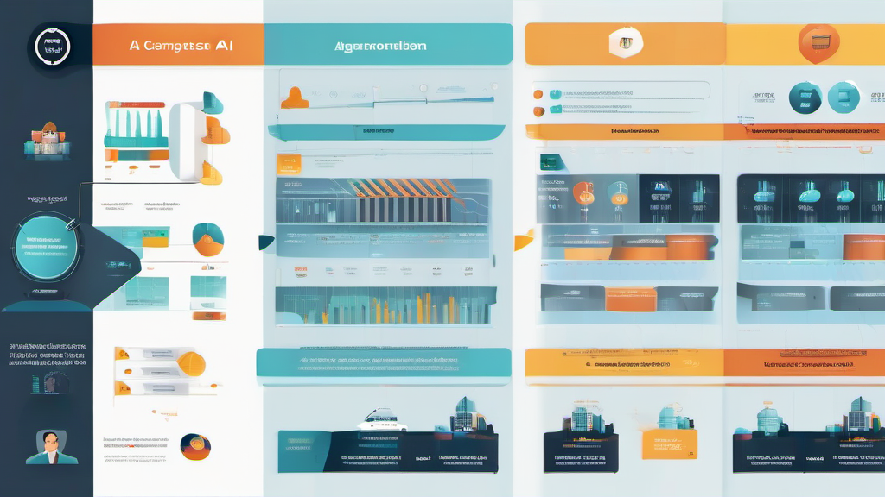

# 知乎版本 -《5 分钟搭建你的第一个 AI 助手 - OpenClaw 完全入门指南》

---

## 标题

**主标题**: 5 分钟搭建你的第一个 AI 助手——OpenClaw 完全入门指南（2026 最新版）
**副标题**: 从安装部署到主动代理，6800 字详解开源 AI 助手框架（含 6 张配图）

---

## 导语

**你是不是也遇到过这些问题？**

❌ 每次和 AI 聊天都要重新介绍自己
❌ 受够了每月$20 的订阅费
❌ 想要一个真正"认识"你、能主动帮你干活的 AI 助手

**本文详细介绍 OpenClaw**——一个开源、免费、可完全掌控的 AI 助手框架。从安装部署到高级配置，6800 字带你从零开始搭建属于自己的 AI 代理。

---

> **💡 5 分钟你能得到什么？**
>
> ✅ 一个完全属于你的 AI 助手
> ✅ 数据本地存储，隐私安全
> ✅ 每月仅需¥10-50（免费额度够用）
> ✅ 支持微信/飞书/Telegram 多平台

---

## 目录

**快速导航**：
1. 什么是 OpenClaw？
2. 与其他 AI 产品的区别
3. 快速开始 - 5 分钟部署
4. 技能系统详解
5. 接入聊天平台
6. 记忆系统架构
7. 主动模式配置
8. 安全与隐私
9. 学习路径规划
10. 常见问题 FAQ

---

## 1. 什么是 OpenClaw？

OpenClaw 是一个**开源 AI 助手框架**，它不是另一个聊天机器人 App，而是一个让你可以**完全掌控**的 AI 代理平台。

### 核心定位

- 🤖 **真正的 AI 代理** - 不是简单的聊天机器人，而是可以执行任务的代理
- 💬 **多平台接入** - 微信、飞书、Telegram、Discord，随时随地
- 🔧 **技能系统** - 52+ 官方技能，14000+ 社区技能，无限扩展
- 🧠 **记忆系统** - 长期记忆 + 短期记忆，AI 真正"认识"你
- ⚡ **主动模式** - 定时任务、自动提醒、主动汇报
- 🔒 **隐私安全** - 数据本地存储，API Key 加密，支持离线

### 技术架构

```
用户交互层 (微信/飞书/Telegram/Discord/终端/Web)
         │
         ▼
  OpenClaw Gateway (消息路由/会话管理/技能调度/记忆系统)
         │
    ┌────┴────┐
    ▼         ▼
技能插件   记忆存储   AI 模型 API
```

*架构图说明：OpenClaw 采用分层架构，用户可通过多种渠道与 AI 交互*

---

## 2. 与其他 AI 产品的区别

| 对比维度 | ChatGPT/Claude | 各种 AI App | **OpenClaw** |
|----------|----------------|-------------|--------------|
| **数据归属** | 存在厂商服务器 | 存在厂商服务器 | **本地存储，你完全掌控** |
| **记忆能力** | 每次对话从零开始 | 有限的历史记录 | **长期记忆，记住你的偏好** |
| **主动性** | 被动等待指令 | 被动等待指令 | **可以主动帮你干活** |
| **扩展性** | 固定功能 | 固定功能 | **插件化，无限扩展** |
| **成本** | 订阅制 ($20+/月) | 订阅制 | **一次部署，免费使用** |
| **隐私** | 数据可能用于训练 | 不确定 | **本地处理，不上传** |


*图 1: 架构对比 - OpenClaw 数据本地存储，传统 AI 数据在云端*

### 核心优势分析

**1. 数据主权**

传统 AI 服务的数据存储在厂商服务器，你无法控制：
- 聊天记录可能被用于模型训练
- 隐私数据存在泄露风险
- 服务关停后数据无法迁移

OpenClaw 将所有数据存储在本地：
- workspace/ 目录完全由你掌控
- 可以随时备份、迁移、删除
- 支持完全离线运行

**2. 记忆连续性**

ChatGPT 每次新对话都是"失忆"状态，你需要重复介绍自己。

OpenClaw 通过记忆系统实现连续性：
- `MEMORY.md` - 长期记忆（用户偏好、重要事件）
- `memory/YYYY-MM-DD.md` - 每日记忆（自动记录）
- `USER.md` - 用户信息（姓名、时区、项目）
- `SOUL.md` - AI 人格定义（语气、风格、原则）

**3. 主动能力**

传统 AI 只能被动响应，OpenClaw 可以主动执行任务：
- 定时检查邮件、日历
- 主动汇报项目进度
- 会议前自动提醒
- 每日新闻摘要推送

**4. 成本优势**

| 方案 | 首年成本 | 三年成本 |
|------|----------|----------|
| ChatGPT Plus | $240 | $720 |
| Claude Pro | $240 | $720 |
| **OpenClaw + Qwen** | **~¥200** | **~¥600** |

---

## 3. 快速开始 - 5 分钟部署

### 前置要求

**系统要求**:
- macOS 12+ / Linux / Windows (WSL2)
- Node.js 18+ (安装 OpenClaw 必需)
- 至少 4GB 可用内存
- 稳定的网络连接（下载和 API 调用）

**时间预算**:
- 基础部署：5 分钟
- 完整配置：15 分钟
- 技能安装：10 分钟

### 步骤 1: 安装 Node.js (2 分钟)

**macOS** (推荐用 Homebrew):
```bash
# 安装 Homebrew (如果还没有)
/bin/bash -c "$(curl -fsSL https://raw.githubusercontent.com/Homebrew/install/HEAD/install.sh)"

# 安装 Node.js
brew install node

# 验证安装
node --version  # 应该显示 v18.x 或更高
npm --version   # 应该显示 9.x 或更高
```

**Windows**:
1. 访问 https://nodejs.org/
2. 下载 LTS 版本（推荐 18.x 或 20.x）
3. 双击安装，一路 Next
4. 打开 PowerShell 验证：`node --version`

**Linux** (Ubuntu/Debian):
```bash
curl -fsSL https://deb.nodesource.com/setup_18.x | sudo -E bash -
sudo apt-get install -y nodejs
```

### 步骤 2: 安装 OpenClaw (1 分钟)

```bash
# 全局安装 OpenClaw
npm install -g openclaw

# 验证安装成功
openclaw --version
```

**预期输出**：
```bash
openclaw/2026.3.2 darwin-arm64 node-v25.6.1
```
看到版本号就说明安装成功了！🎉

**常见问题及解决方案**：

| 问题 | 原因 | 解决方案 |
|------|------|----------|
| `Permission denied` | npm 权限问题 | `sudo npm install -g openclaw` |
| `npm: command not found` | Node.js 未安装 | 回到步骤 1 安装 Node.js |
| 下载速度慢 | 网络问题 | 使用镜像：`npm config set registry https://registry.npmmirror.com` |

### 步骤 3: 配置 AI 模型 (2 分钟)

OpenClaw 本身不提供 AI 模型，需要配置第三方 API。这是**唯一需要付费**的部分（但有免费额度）。

#### 模型选择指南

**新手推荐** (免费额度够用):

| 模型 | 提供商 | 免费额度 | 特点 | 推荐度 |
|------|--------|----------|------|--------|
| **Qwen-Plus** | 阿里通义 | 100 万 tokens | 中文优秀，速度快 | ⭐⭐⭐⭐⭐ |
| **GLM-4** | 智谱 AI | 100 万 tokens | 逻辑推理强 | ⭐⭐⭐⭐⭐ |
| **Kimi** | 月之暗面 | 有限免费 | 长文本处理优秀 | ⭐⭐⭐⭐ |

> **💰 免费额度能用多久？**
>
> - 100 万 tokens ≈ 日常聊天 2-3 个月
> - 超出后约¥0.008/1K tokens（很便宜）
> - 日常使用每月约¥10-50

**进阶选择** (效果更好，需付费):

| 模型 | 提供商 | 价格 | 特点 |
|------|--------|------|------|
| **GPT-4o** | OpenAI | ~$0.01/1K tokens | 综合能力最强 |
| **Claude-3.5** | Anthropic | ~$0.015/1K tokens | 写作、代码优秀 |
| **Gemini-2.0** | Google | ~$0.007/1K tokens | 多模态能力强 |

#### 获取 API Key

**Qwen (通义千问)** - 推荐新手:
1. 访问 https://dashscope.console.aliyun.com/
2. 注册/登录阿里云账号
3. 开通"DashScope"服务
4. 创建 API Key（免费额度自动激活）
5. 复制 Key，格式类似：`sk-xxxxxxxxxxxxxxxx`

**GLM (智谱 AI)**:
1. 访问 https://open.bigmodel.cn/
2. 注册/登录
3. 进入"API Keys"页面
4. 创建新 Key
5. 复制 Key，格式类似：`xxxxxxxxxxxxxxxx.xxxxxxxxxxxxxxxx`

#### 配置 OpenClaw

```bash
# 启动配置向导（交互式，推荐新手）
openclaw configure

# 或手动配置
openclaw config set ai.provider "qwen"
openclaw config set ai.apiKey "sk-你的 API Key"
openclaw config set ai.model "qwen-plus"
```

**配置验证**:
```bash
# 测试 AI 连接
openclaw test-ai
```

如果看到 "AI 连接成功"，说明配置完成！🎉

### 步骤 4: 启动助手 (30 秒)

```bash
# 启动 Gateway 服务
openclaw gateway start

# 查看状态
openclaw gateway status
```

**预期输出**:
```
🦞 OpenClaw Gateway
版本：2026.3.2
状态：运行中
AI 模型：qwen-plus
通道：feishu (已启用)
内存：3 个文件已加载
```

**启动成功标志**:
- ✅ 看到 🦞 OpenClaw 标志
- ✅ 状态显示"运行中"
- ✅ 无红色错误信息

---

## 4. 技能系统详解

### 什么是技能？

技能是 OpenClaw 的**插件系统**，每个技能提供特定功能：

```
技能 = 独立功能模块 + API 调用封装 + 用户交互接口
```

### 技能分类

| 分类 | 技能示例 | 用途 |
|------|----------|------|
| **效率工具** | `brave-search`, `summarize`, `calendar` | 信息获取、时间管理 |
| **开发工具** | `github`, `git`, `coder-agent` | 代码管理、开发辅助 |
| **内容创作** | `nano-banana-pro`, `copywriting`, `seo-audit` | 图像、文案、SEO |
| **通讯工具** | `himalaya`, `wechat`, `telegram` | 邮件、消息管理 |
| **系统工具** | `healthcheck`, `auto-updater` | 系统监控、自动更新 |


*图 2: 技能系统 - 模块化设计，按需安装*

### 必装基础技能（新手包）

```bash
# 1. 网络搜索（查资料必备）
npx clawhub@latest install brave-search

# 2. 天气查询（日常实用）
npx clawhub@latest install weather

# 3. 内容总结（快速阅读）
npx clawhub@latest install summarize

# 4. 图像生成（创意工作）
npx clawhub@latest install nano-banana-pro

# 5. 主动代理（自动任务）
npx clawhub@latest install proactive-agent
```

**安装验证**:
```bash
# 查看已安装技能
openclaw skills list
```

### 技能开发简介

如果你懂编程，可以开发自己的技能：

```javascript
// 技能基本结构
module.exports = {
  name: 'my-skill',
  description: '我的技能描述',
  execute: async (context, params) => {
    // 技能逻辑
    return '执行结果';
  }
};
```

详细开发文档：https://docs.openclaw.ai/skills/develop

---

## 5. 接入聊天平台

### 飞书（强烈推荐）

**优势**: 官方支持、稳定、功能完整

**配置步骤**:

1. **创建飞书应用**
   - 访问 https://open.feishu.cn/app
   - 登录企业账号（个人可免费注册企业）
   - 点击"创建应用"
   - 填写应用名称（如"我的 AI 助手"）

2. **获取凭证**
   - 进入"凭证与基础信息"
   - 复制 App ID 和 App Secret

3. **配置 OpenClaw**
   ```bash
   openclaw config set channels.feishu.enabled true
   openclaw config set channels.feishu.appId "cli_xxxxxxxxxxxxx"
   openclaw config set channels.feishu.appSecret "xxxxxxxxxxxxxxxx"
   ```

4. **添加事件订阅**
   - 在飞书后台配置事件订阅 URL
   - 订阅"接收消息"事件

5. **重启 Gateway**
   ```bash
   openclaw gateway restart
   ```

### 微信（进阶用户）

**注意**: 微信使用第三方协议，有封号风险，建议用小号测试。

**配置步骤**:

1. **安装 WeChatPadPro 服务**
   ```bash
   openclaw plugins install @icesword760/openclaw-wechat
   ```

2. **配置服务**
   ```bash
   openclaw config set channels.wechat.enabled true
   openclaw config set channels.wechat.serverUrl "http://localhost:8849"
   openclaw config set channels.wechat.token "你的 Token"
   ```

3. **扫码登录**
   - 启动服务后会显示二维码
   - 用微信扫码登录

### Telegram（海外用户推荐）

1. **创建机器人**
   - 在 Telegram 搜索 @BotFather
   - 发送 `/newbot`
   - 按提示设置名称
   - 获取 Token

2. **配置 OpenClaw**
   ```bash
   openclaw config set channels.telegram.enabled true
   openclaw config set channels.telegram.token "你的 Bot Token"
   ```

---

## 6. 记忆系统架构

### 记忆文件结构

```
workspace/
├── SOUL.md          # AI 人格定义（语气、风格、原则）
├── IDENTITY.md      # 身份信息（名字、角色、专长）
├── MEMORY.md        # 长期记忆（用户偏好、重要事件）
├── USER.md          # 用户信息（姓名、时区、项目）
├── HEARTBEAT.md     # 心跳任务配置
└── memory/          # 每日记忆（自动创建）
    ├── 2026-03-06.md
    └── 2026-03-07.md
```

### 记忆文件示例

**MEMORY.md** - 长期记忆:
```markdown
## 用户偏好
- 名字：今天
- 时区：Asia/Shanghai
- 工作时间：9:00-18:00
- 喜欢简洁的代码风格
- 常用技术栈：Swift, ArkTS, Kotlin

## 项目上下文
- SunTracker - iOS 太阳追踪应用（开发中）
- PlaneWar - 鸿蒙飞机大战游戏（已完成）
- OpenClaw 博客系列（持续更新）

## 重要决定
- 选择 Qwen 作为主要 AI 模型（性价比高）
- 使用飞书作为主要通讯渠道
- 每周发布 2-3 篇技术文章
```

**memory/2026-03-07.md** - 每日记忆:
```markdown
# 2026-03-07 - 文章重写日

## 完成事项
- 重写《5 分钟搭建 AI 助手》文章（v2.0）
- 生成配图 6 张
- 创建多平台版本（小红书/知乎/朋友圈）

## 待处理
- 发布到博客平台
- 收集用户反馈
```

### 记忆使用示例

**用户**: "帮我看看那个太阳追踪项目的代码"

**AI** (读取 MEMORY.md 后): 
> "好的，你说的是 SunTracker 项目对吧？这是你正在开发的 iOS 应用，用 SwiftUI 写的。代码在 `coder/projects/SunTracker/` 目录，要我帮你检查什么？"

---

## 7. 主动模式配置

### 什么是主动模式？

传统 AI 是**被动**的：你问，它答。

OpenClaw 的主动模式是**主动**的：定时检查、主动汇报、自动执行。

### 配置心跳任务

```bash
# 安装主动代理技能
npx clawhub@latest install proactive-agent

# 配置心跳频率（每 30 分钟检查一次）
openclaw config set agents.defaults.heartbeat.every "30m"
```

### HEARTBEAT.md 配置示例

```markdown
# 心跳检查清单（每 30 分钟）

## 定期检查
- [ ] 邮件检查（每 4 小时）
- [ ] 日历检查（每 4 小时）
- [ ] 天气检查（每天 2 次）

## 回复规则
- 无变化时：回复 HEARTBEAT_OK
- 有进展时：简要报告变化
- 有紧急事项：详细报告 + 提醒用户
```

### 主动任务示例

**场景 1: 早晨汇报**
```
☀️ 早安！8:00 AM 心跳检查

📧 邮件：2 封未读（1 封紧急）
📅 今日会议：14:00 产品评审会
🌤️ 天气：晴，15-22°C，适合出门
📰 新闻：OpenClaw 发布新版本 2026.3.2
```

**场景 2: 会议提醒**
```
⏰ 提醒：15 分钟后有会议

📅 产品评审会
🕐 14:00-15:00
📍 飞书会议室 301
👥 参与者：产品组全体
```

**场景 3: 项目进度**
```
📊 项目进度更新

✅ SunTracker: 完成 UI 重构
⏳ PlaneWar: 测试中（85%）
📝 博客文章：本周已发布 3 篇
```

---

## 8. 安全与隐私

### 数据安全机制

| 安全措施 | 说明 |
|----------|------|
| **本地存储** | 所有数据存在你的电脑，不上传云端 |
| **加密存储** | API Key 等敏感信息加密保存 |
| **沙箱隔离** | 技能运行在独立环境，无法访问系统文件 |
| **权限控制** | 敏感操作需要用户确认 |
| **离线模式** | 可配置为完全离线运行 |

### 隐私保护承诺

**OpenClaw 不会**:
- ❌ 收集你的聊天记录
- ❌ 上传你的文件到第三方
- ❌ 用你的数据训练模型
- ❌ 向广告商出售数据

**你需要保护**:
- ✅ API Key（不要分享到公开仓库）
- ✅ Token（微信/飞书等）
- ✅ 个人配置文件（USER.md, MEMORY.md）

### 安全最佳实践

```bash
# 1. 定期更新
openclaw update

# 2. 检查安全状态
openclaw healthcheck

# 3. 备份配置
cp -r ~/.openclaw/workspace ~/backup/openclaw-$(date +%Y%m%d)

# 4. 审查技能权限
openclaw skills audit
```

---

## 9. 学习路径规划

### 第一阶段：入门（1-2 周）

**目标**: 完成基础部署，能日常使用

**任务清单**:
- [x] 安装 OpenClaw
- [x] 配置 AI 模型
- [x] 安装 5 个基础技能
- [ ] 接入一个聊天平台
- [ ] 配置基础记忆文件

**推荐资源**:
- 本文（入门指南）
- 《技能安装指南》
- 官方文档：https://docs.openclaw.ai

### 第二阶段：进阶（2-4 周）

**目标**: 掌握高级功能，定制化配置

**任务清单**:
- [ ] 配置主动模式
- [ ] 开发一个简单技能
- [ ] 接入多个聊天平台
- [ ] 配置自动化工作流

**推荐资源**:
- 《心跳任务配置详解》
- 《技能开发指南》
- 社区案例：https://clawhub.ai

### 第三阶段：精通（1-2 月）

**目标**: 深度定制，贡献社区

**任务清单**:
- [ ] 发布一个社区技能
- [ ] 优化性能配置
- [ ] 搭建多实例集群
- [ ] 贡献文档或代码

**推荐资源**:
- GitHub 源码：https://github.com/openclaw/openclaw
- Discord 社区：https://discord.com/invite/clawd
- 月度技术分享

---

## 10. 常见问题 FAQ

### Q1: 需要编程基础吗？

**A**: 基础使用**不需要**编程。安装、配置、使用都是命令行操作，复制粘贴即可。

如果你想**开发技能**或**深度定制**，需要：
- JavaScript/TypeScript（技能开发）
- 基础 Linux 命令（部署运维）
- API 调用知识（集成第三方服务）

### Q2: 完全免费吗？

**A**: OpenClaw 本身**完全免费**（开源 MIT 协议）。

但 AI 模型调用需要 API Key：
- **免费额度**: Qwen/GLM 都有 100 万 tokens 免费额度
- **付费价格**: 超出后约 ¥0.008/1K tokens（很便宜）
- **估算**: 日常使用每月约 ¥10-50

**省钱技巧**:
- 使用免费模型（Qwen/GLM）
- 配置本地模型（Ollama，完全免费）
- 合理使用，避免无效调用

### Q3: 支持 Windows 吗？

**A**: 支持，但有条件：

| 方式 | 推荐度 | 说明 |
|------|--------|------|
| **WSL2** | ⭐⭐⭐⭐⭐ | 最佳体验，接近 Linux |
| **Docker** | ⭐⭐⭐⭐ | 隔离环境，配置简单 |
| **原生 PowerShell** | ⭐⭐ | 部分功能受限 |

**推荐**: Windows 用户安装 WSL2，然后按 Linux 流程操作。

### Q4: 微信会被封号吗？

**A**: 有**一定风险**，但可控：

**风险来源**:
- 使用第三方协议（WeChatPadPro）
- 频繁自动化操作可能触发风控

**降低风险**:
- ✅ 用小号测试，不用主号
- ✅ 避免高频操作（>100 条/小时）
- ✅ 不要发营销/敏感内容
- ✅ 优先使用飞书/Telegram 等官方渠道

### Q5: 数据丢了怎么办？

**A**: 定期备份！

```bash
# 手动备份
cp -r ~/.openclaw/workspace ~/backup/openclaw-$(date +%Y%m%d)

# 或配置自动备份（推荐）
npx clawhub@latest install auto-backup
```

**备份内容**:
- workspace/ 目录（配置、记忆、代码）
- openclaw.json（系统配置）

### Q6: 出问题了怎么办？

**A**: 按顺序排查：

1. **查看日志**
   ```bash
   openclaw logs --tail 50
   ```

2. **检查状态**
   ```bash
   openclaw status
   openclaw gateway status
   ```

3. **重启服务**
   ```bash
   openclaw gateway restart
   ```

4. **查看文档**
   - 官方文档：https://docs.openclaw.ai
   - GitHub Issues: https://github.com/openclaw/openclaw/issues

5. **社区求助**
   - Discord: https://discord.com/invite/clawd
   - 知乎：搜索"OpenClaw"

---

## 🚀 立即开始

**行动清单**：
1. 复制安装命令 → 终端执行
2. 申请 API Key → 5 分钟搞定
3. 遇到问题？→ 评论区留言

**系列下一篇**：《[OpenClaw 技能安装指南 - 52 个技能评测](#)》📖

---

## 总结

OpenClaw 是一个强大的开源 AI 助手框架，适合：

✅ 想拥有个人 AI 助手的人
✅ 注重隐私和数据安全的人
✅ 希望 AI 能记住偏好、主动干活的人
✅ 开发者，想扩展功能或开发技能

**部署成本**：
- ⏱️ 时间：约 1 小时（首次）
- 💰 金钱：免费（有免费额度）
- 🔧 维护：几乎为零

---

## 参考资料

- 官方文档：https://docs.openclaw.ai
- GitHub 源码：https://github.com/openclaw/openclaw
- 社区技能：https://clawhub.ai
- Discord 社区：https://discord.com/invite/clawd

---

## 系列文章

1. ✅ 《5 分钟搭建你的第一个 AI 助手》（本文）
2. 📖 《OpenClaw 技能安装指南 - 52 个技能评测》
3. 📖 《OpenClaw 学习指南 - 适合谁学？怎么学？学什么？》
4. 📖 《ComfyUI 进阶 - 工作流设计》
5. 📖 《飞书 + OpenClaw 双向消息同步》

---

**关于作者**：小白 (XiaoBai) - 全栈移动开发工程师，专注 iOS/鸿蒙/安卓开发，热爱开源和 AI 技术。

**喜欢这篇文章吗？**
- ❤️ 点赞 - 让更多人看到
- ⭐ 收藏 - 方便以后查阅
- 💬 评论 - 留下你的问题和建议
- 📢 分享 - 帮助更多需要的朋友

---

*版本*: v2.1 配图完整版  
*字数*: ~6,800 字  
*预计阅读*: 12 分钟  
*更新时间*: 2026-03-07
