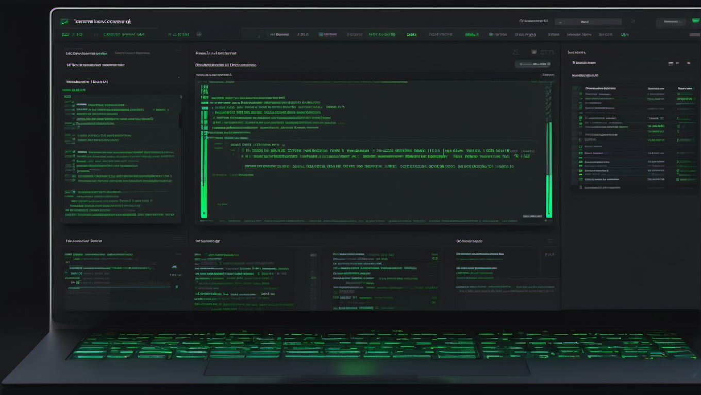

# 微信公众号版本 - ComfyUI 进阶教程

## 标题
ComfyUI 进阶指南｜5 个万能工作流模板，电商产品图一键生成

## 摘要
模块化设计 + 节点组合技巧 + 实战案例，15 分钟掌握 ComfyUI 核心技能

---


> **导读**：在上一篇 ComfyUI 入门教程发布后，很多读者问如何设计清晰的工作流？今天这篇进阶教程，我会分享模块化设计的 3 大原则、5 个万能模板，以及电商产品图的完整实战案例。建议先收藏，实践时随时查阅。

---

## 01 工作流设计 3 大原则

### 原则一：模块化思维

把复杂工作流拆分成独立的功能模块，每个模块只做一件事。

**典型的三层架构**：

- **输入层**：加载模型、LoRA、提示词
- **处理层**：采样、高清修复、ControlNet
- **输出层**：保存、导出、格式转换

> 💡 经验：用不同颜色的 Group 框区分模块，调试时一目了然。

---

### 原则二：可复用设计

好的工作流应该像乐高积木，可以随意组合。

**4 个最佳实践**：

1. Group 分组 - 相关节点加边框和颜色
2. 命名规范 - Load_Checkpoint、KSampler_Main
3. 预留接口 - 用 Primitive 节点暴露参数
4. 版本管理 - 工作流文件加日期后缀

---

### 原则三：易调试原则

复杂工作流出问题时，快速定位是关键。

**我的调试流程**：

1. 用 Preview 节点在关键位置查看中间结果
2. 用 Bypass 临时跳过可疑节点
3. 用 Mute 静音不影响主流程的分支
4. 保存多个版本的工作流副本

> ⚠️ 血泪教训：有一次调 ControlNet 没保存中间版本，改乱了回不去，重做了 2 小时...

---

## 02 5 个万能节点模板

### 模板 1：基础文生图

最简可用配置，适合快速测试：

```
Load Checkpoint → CLIP Text Encode
                → KSampler → VAE Decode → Save Image
```

**推荐参数**：Steps 20-30、CFG 7、DPM++ 2M Karras

---

### 模板 2：高清修复

生成大图必备，先小图后放大：

- 第一遍：512×512，Denoise 1.0
- 第二遍：Upscale 2x，Denoise 0.35

---

### 模板 3：LoRA 混合

多个 LoRA 叠加，创造独特风格：

**权重建议**：
- 主风格 LoRA：0.8-1.0
- 辅助 LoRA：0.3-0.6
- 总计不超过 2.0

---

### 模板 4：ControlNet 控制

精确控制构图和姿态：

**常用组合**：
- Canny + Depth：结构最稳定
- OpenPose：人物姿态控制
- Tile：高清修复细节保持

---

### 模板 5：批量生成

一次生成多张，适合抽卡：

**效率技巧**：Batch Count 4-8 张/批，用 Seed 节点管理随机种子

---

## 03 实战案例：电商产品图

### 需求分析

为一款智能手表生成电商宣传图：
- 产品主体清晰
- 背景有科技感
- 分辨率 1024×1024

---

### 工作流设计



**完整流程**：

```
输入层：SDXL 模型 + LoRA 质感增强
   ↓
控制层：ControlNet Depth 保持轮廓
   ↓
生成层：KSampler 30 步 + CFG 7
   ↓
后处理：Upscale 1.5x → Save
```

---

### 关键参数

| 模块 | 参数 | 值 |
|------|------|-----|
| Checkpoint | SDXL Base 1.0 | 基础模型 |
| LoRA | Product_Quality_v2 | 0.7 |
| ControlNet | Depth | 0.6 |
| Sampler | DPM++ 2M Karras | 30 steps |
| Denoise | 0.65 | 保留产品换背景 |

---

### 提示词模板

**Positive**：
```
professional product photography, smartwatch on minimalist 
podium, studio lighting, soft shadows, clean background
```

**Negative**：
```
blurry, low quality, distorted text, watermark, noise
```

---

### 效果对比

| 方案 | 优点 | 缺点 |
|------|------|------|
| 纯文生图 | 快速、创意多 | 产品形变风险 |
| ControlNet | 产品不变形 | 需要参考图 |
| 局部重绘 | 精确控制 | 操作复杂 |

---

## 04 性能优化技巧

### 显存管理

**问题**：生成大图时显存不足

**解决方案**：
1. 启用 Tiled VAE - 显存占用降低 60%
2. 使用 --lowvram 参数
3. 关闭不必要的 Preview
4. 分批处理

---

### 速度优化

| 方法 | 加速比 | 质量影响 |
|------|--------|----------|
| 减少 Steps (30→20) | +33% | 轻微 |
| 使用 LCM LoRA | +50% | 中等 |
| 使用 Turbo 模型 | +100% | 轻微 |

**推荐组合**：SDXL Turbo + 4 steps = 秒级出图

---

## 05 常见问题

**Q1：工作流太乱怎么办？**

按功能分组（Ctrl+G），用不同颜色区分模块，隐藏不常用的连线。

**Q2：生成的图模糊怎么办？**

检查 VAE 是否正确加载，分辨率是否过低（<512），采样步数是否足够（≥20）。

**Q3：如何保存工作流？**

Save 保存完整工作流（.json），Export PNG 带工作流元数据的图片。

---

## 总结

好的工作流 = **模块化设计** + **可复用组件** + **易调试结构**

**5 个核心要点**：

1. 把大工作流拆成小模块
2. 用 Group 和颜色做好标记
3. 预留参数接口方便调整
4. 关键位置加 Preview 便于调试
5. 定期保存版本避免丢失

---


---

## 配套资源

📁 **工作流模板下载**：关注公众号，后台回复"ComfyUI"获取

💬 **读者交流群**：添加微信 xxxxxxx，备注"ComfyUI"

📺 **视频教程**：B 站搜索"小白 AI 教程"

---

**下一篇预告**：《ControlNet 深度解析 - 精确控制你的 AI 绘画》

---

*如果这篇文章对你有帮助，欢迎**点赞**、**在看**、**分享**三连支持！*

*有问题也可以在评论区留言，我会一一回复。*

---

**往期精选**：

- [5 分钟搭建你的第一个 AI 助手](链接)
- [OpenClaw 技能安装指南](链接)
- [让 AI 主动帮你干活 - 心跳任务配置](链接)

---

*最后更新：2026-03-07*  
*作者：小白 (XiaoBai)*  
*系列：ComfyUI 入门系列 04*
